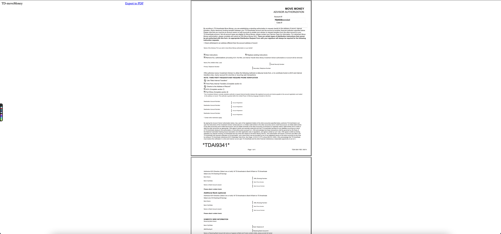

Building with Laravel, Docker, DOMPDF, and MySQL

<h3>Installation</h3>

Simply clone or fork this repository into your Laravel project and create a local database with <b>php artisan migrate</b> while in your project's directory.

Site launches as https://example.test/
